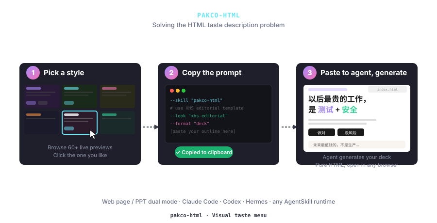

# pakco.html · Visual taste menu for AI agents

**English** · [中文说明 →](README.zh-CN.md)

[](LICENSE)



**Stop describing taste. Pick it.**

A local-first visual menu for AI agents — browse 60+ real previews, click a card, get an executable prompt. Paste it into Claude Code / Codex / Hermes and the agent generates the deck following the visual constraints you picked.

## ▶ Quick start

```bash
npx skills add https://github.com/pakco77/pakco-html

# serve for live iframe previews
cd ~/.claude/skills/pakco-html && python3 -m http.server 8000
# visit: http://localhost:8000/templates/style-picker.html
```

Click any card → prompt copied → paste into your agent → done.

## 📦 What's inside

| Tab | What | Count |
|---|---|---|
| 🎨 Skins | CSS re-skin over shared layout | 36 |
| 📑 Templates | Full decks — landscape & vertical pages | 23 |
| 🧩 UI Taste | UI style system | 4 |
| 🖼 Social Cards | Social image tones + deck templates | 4 tones |

Plus 31 single-page layouts, 27 CSS animations, 20 canvas FX, and presenter mode (`S` key).

## 🙏 Credit

The visual work belongs to upstream authors — this repo is a packaging + picker layer:

- 🎨 [lewislulu/html-ppt-skill](https://github.com/lewislulu/html-ppt-skill) — core skill: skins, layouts, animations, runtime
- 🪶 [op7418/guizang-ppt-skill](https://github.com/op7418/guizang-ppt-skill) — magazine & Swiss deck templates
- 🖼 [op7418/guizang-social-card-skill](https://github.com/op7418/guizang-social-card-skill) — social card system
- 🧩 [Leonxlnx/taste-skill](https://github.com/Leonxlnx/taste-skill) — UI taste system

## License

MIT © 2026 lewis. Upstream skills retain their own licenses.
